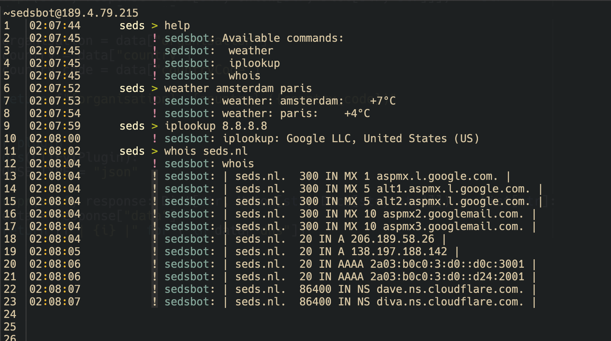

# Personal IRC bot

## About The Project

A simple IRC bot which allows easily integrating new commands. See the Extending
for information on how to add new plugins.



### Built With

- [Python](https://python.org)
- [Python IRC](https://github.com/jaraco/irc)

## Getting Started

### Prerequisites

- Docker
- Docker-compose

### Installation

1. Run `docker-compose up`

## Usage

Create a `.env` file (see `.env.example`) with the required environment or
change the environments in `docker-compose.yaml`.

## Extending

New commands may be added by creating a new command file in `src/modules`, and
implementing the following class:

```python
from core.plugins import Plugin, register_plugin

@register_plugin(
    name="weather", description="check the weather", arguments="amsterdam paris ..."
)
class CommandName(Plugin):
    async def __call__(self, msg: Sequence[str]) -> str:
        ...

```

This will create a new command on the name of `weather`. The command supports
multiple cities to be queried. For example, user X sends `commandname arg1 arg2`,
thus msg will be `[arg1, arg2]`.

## TODOs

- Add test cases. This started as one simple `main.py`, so I didn't care much on
  testing.
- Add more usable plugins

## License

Distributed under the MIT License. See `LICENSE` for more information.
